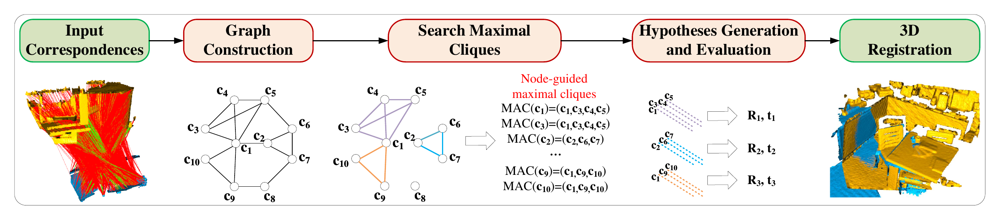

# 3D Registration with Maximal Cliques (CVPR23 best student paper award)
Source code of [3D Registration with Maximal Cliques](https://openaccess.thecvf.com/content/CVPR2023/html/Zhang_3D_Registration_With_Maximal_Cliques_CVPR_2023_paper.html).  

## Introduction  
In this paper, we present a 3D registration method with maximal cliques (MAC). The key insight is to loosen the previous maximum clique constraint,
and mine more local consensus information in a graph for accurate pose hypotheses generation: 1) A compatibility graph is constructed to render the affinity relationship between initial correspondences. 2) We search for maximal cliques in the graph, each of which represents a consensus set. We perform node-guided clique selection then, where
each node corresponds to the maximal clique with the greatest graph weight. 3) Transformation hypotheses are computed for the selected cliques by the SVD algorithm and
the best hypothesis is used to perform registration. Extensive experiments on U3M, 3DMatch, 3DLoMatch and KITTI demonstrate that MAC effectively increases registration accuracy, outperforms various state-of-the-art methods and boosts the performance of deep-learned methods. MAC combined with deep-learned methods achieves stateof-the-art registration recall of **95.7% / 78.9%** on 3DMatch / 3DLoMatch.


## Repository layout  
The repository contains a set of subfolders:  
* [`Linux`](https://github.com/zhangxy0517/3D-Registration-with-Maximal-Cliques/tree/main/Linux) - source code for Linux platform.  
* [`Windows`](https://github.com/zhangxy0517/3D-Registration-with-Maximal-Cliques/tree/main/Windows) - source code for Windows platform.
* [`Python_implement`](https://github.com/zhangxy0517/3D-Registration-with-Maximal-Cliques/tree/main/Python_implement) - python implementation of basic MAC.
* [`demo`](https://github.com/zhangxy0517/3D-Registration-with-Maximal-Cliques/tree/main/demo) - test point clouds.


## Build
MAC depends on [PCL](https://github.com/PointCloudLibrary/pcl/tags) (`>= 1.10.1`, version `1.10.1` is recommended) and [igraph](https://github.com/igraph/igraph/tags)(`=0.9.9`). Please install these libraries first.

To build MAC, you need [CMake](https://cmake.org/download/) (`>= 3.23`) and, of course, a compiler that supports `>= C++11`. The code in this repository has been tested on Windows (MSVC `=2022` `x64`), and Linux (GCC `=10.4.0`). Machines nowadays typically provide higher [support](https://en.cppreference.com/w/cpp/compiler_support), so you should be able to build MAC on almost all platforms.

### Windows version  
Please refer to [Compiling on Windows](https://github.com/zhangxy0517/3D-Registration-with-Maximal-Cliques/blob/main/Windows/readme.md) for details.

### Linux version
Please refer to [Compiling on Linux](https://github.com/zhangxy0517/3D-Registration-with-Maximal-Cliques/blob/main/Linux/readme.md) for details.

### Python implementation
We provide a simple demo in python, please refer to [Python_implement](https://github.com/zhangxy0517/3D-Registration-with-Maximal-Cliques/blob/main/Python_implement/README.md) for details.

## Usage:
* `--help` list all usages.
* `--demo` run the demo.
### Required args:
* `--output_path` output path for saving results. 
* `--input_path` input data path. 
* `--dataset_name`[3dmatch/3dlomatch/KITTI/ETH/U3M] dataset name.
* `--descriptor`[fpfh/fcgf/spinnet/predator] descriptor name. 
* `--start_index`(begin from 0) run from given index. 
### Optional args:
* `--no_logs` forbid generation of log files.

## Datasets
All tested datasets can be found at this [link](https://pan.baidu.com/s/1KZS2LccseYJZWMmDG0xDbw), password：1234.

## Results
### U3M


### 3DMatch & 3DLoMatch

|    Benchmark   | RR(%) | RE(°) |TE(cm) |
|:---------------|:-----:|:-----:|:-----:|
|  3DMatch+FPFH+MAC  | 84.10 | 1.96  | 6.18  |
|  3DMatch+FCGF+MAC  | 93.72 | 1.89  | 6.03  |
|  3DLoMatch+FPFH+MAC  | 40.88 | 3.66  | 9.45  |
|  3DLoMatch+FCGF+MAC  | 59.85 | 3.50  | 9.75  |

### KITTI

|    Benchmark   | RR(%) | RE(°) |TE(cm) |
|:---------------|:-----:|:-----:|:-----:|
|  FPFH+MAC  | 99.46 | 0.40  | 8.46  |
|  FCGF+MAC  | 97.84 | 0.34  | 19.34  |

### Performance boosting


## Projects using MAC
* [Zhang et al., FastMAC: Stochastic Spectral Sampling of Correspondence Graph (CVPR 2024)](https://github.com/Forrest-110/FastMAC)

## Citation
If you find this code useful for your work or use it in your project, please consider citing:

```shell
@inproceedings{zhang20233d,
  title={3D Registration with Maximal Cliques},
  author={Zhang, Xiyu and Yang, Jiaqi and Zhang, Shikun and Zhang, Yanning},
  booktitle={Proceedings of the IEEE/CVF Conference on Computer Vision and Pattern Recognition},
  pages={17745--17754},
  year={2023}
}
```
